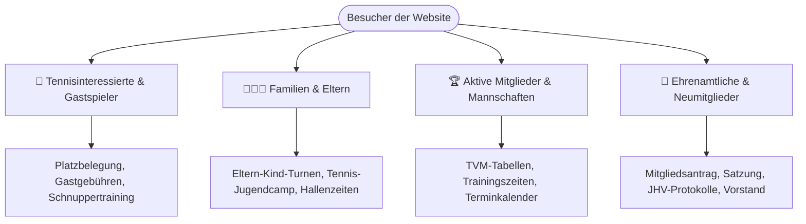

# Website-Relaunch Entwurf: DJK Köln-Bocklemünd 1967 e.V.

> **Motto:** *„Mit dem Herz in Bocklemünd – Von Kölnern für Kölner“*  
> **Schwerpunkt:** Tennis (TG Grün-Weiß, 5 Sandplätze) & Mehrsparten-Breitensport (Badminton, Eltern-Kind-Turnen, Pickleball, Tischtennis, Gymnastik)

---

## 1. UX-Audit & Schwachstellen der bisherigen Website (Wix-Altbestand)

Bei der Auswertung der 42 archivierten Originalseiten fallen folgende Kernprobleme auf:

| Problem der alten Website | Auswirkung auf Besucher | Lösung im neuen Konzept |
|---|---|---|
| **Veraltetes Wix-Layout mit starren Textblöcken** | Wirkt unmodern, lange Ladezeiten, mäßige mobile Lesbarkeit | Blitzschnelle Astro 6 Architektur mit statischem HTML & responsivem Tailwind |
| **Zersplitterte Navigation (viele doppelte Unterseiten wie „Kopie von TT...“)** | Besucher und Mitglieder verlieren die Orientierung | Klare 4-Säulen-Navigation (Tennis, Sportarten, Verein, Service/Kontakt) |
| **Keine prominente Gastspieler- & Platzbuchungshilfe** | Externe Tennisspieler finden Konditionen (z. B. Platzgebühren) nur schwer | Eigene Hero-Callouts für Gastspieler & Platzordnung |
| **Fehlende redaktionelle Trennung** | Sportwarte müssen HTML/Wix-Baukästen manuell bearbeiten | Keystatic Headless CMS für einfache Content-Pflege ohne Programmierkenntnisse |
| **Unübersichtliche Medenspiel-Ergebnisse** | Tabellen sind als statischer Text oder Screenshots hinterlegt | Direkte strukturierte TVM-Integration (nuLiga-Anbindung & Mannschaftskarten) |

---

## 2. Zielgruppen & Kernbedürfnisse



---

## 3. Informationsarchitektur (Die neue Sitemap)

```
djk-bocklemuend.de
├── 🏠 Startseite (Emotionale Begrüßung, Quick-Links, Highlight-Sportarten, Aktuelles)
├── 🎾 Tennis (TG Grün-Weiß)
│   ├── Die Anlage (5 Ascheplätze, Clubhaus, Anfahrt Heinrich-Rohlmann-Str.)
│   ├── Mannschaften (Damen, 1./2. Herren, Damen 30/40, Herren 50/70, Jugend)
│   ├── Training & Trainer (Andreas Witkiewicz & Trainerteam)
│   ├── Schnuppertraining (Kostenlos für Kinder & Erwachsene)
│   ├── Sommercamp (Feriencamp für Kinder & Jugendliche)
│   ├── Gastspieler & Platzgebühren (Regelung, Schuhe, Online-Info)
│   └── Vereinsshop (Teamkleidung & Ausrüstung)
├── 🏅 Sportarten (Mehrspartenverein)
│   ├── Pickleball (Trendsportart im Kölner Westen)
│   ├── Badminton
│   ├── Eltern-Kind-Turnen & Ballgymnastik
│   └── Tischtennis (Historie, Mannschaften, Turniere)
├── 📰 Aktuelles & Termine
│   ├── Vereinsnews & Spielberichte
│   └── Veranstaltungskalender & JHV
└── ℹ️ Der Verein & Service
    ├── Vorstand & Ansprechpartner
    ├── Mitglied werden & Downloads (Beiträge, Aufnahmeantrag PDF)
    ├── Anfahrt & Hallen (Wilhelm-Löhers-Platz vs. Heinrich-Rohlmann-Str.)
    └── Impressum & Datenschutz
```

---

## 4. Design-System & Vereins-Identität

Das neue Farbschema verbindet die Tennis-Tradition von **TG Grün-Weiß** mit den soliden Vereinsfarben der **DJK Bocklemünd**:

* **Primärfarbe (Court-Grün / Frisch):** `#059669` (`emerald-600` / `hover:emerald-700`)  
  *Symbolisiert die 5 Sandplätze im Grünen und die Sparte TG Grün-Weiß.*
* **Sekundärfarbe (DJK Marineblau / Schiefer):** `#0f172a` (`slate-900` / `text-slate-900`)  
  *Steht für Verlässlichkeit, Tradition (seit 1967) und hervorragenden Textkontrast (WCAG 2.1 AA).*
* **Akzentfarbe (Tennis-Sand / Court-Clay):** `#d97706` (`amber-600`)  
  *Subtiler Akzent für Badges, Schnupperaktionen und Buttons.*
* **Hintergrund & Flächen:** `#f8fafc` (`slate-50`) und reines Weiß `#ffffff` mit weichen Schatten (`shadow-sm`, `shadow-md`).

---

## 5. Wireframe-Entwurf der Startseite (Hero & Abschnitte)

```
+-----------------------------------------------------------------------------------+
| [LOGO DJK] DJK Köln-Bocklemünd 1967 e.V.    Tennis  Sportarten  News  Termine  [Schnuppern] |
+-----------------------------------------------------------------------------------+
| HERO SECTION:                                                                     |
| "Mit dem Herz in Bocklemünd – Von Kölnern für Kölner"                             |
| Dein Sportverein im Kölner Westen: 5 Ascheplätze, Breitensport & gelebte Gemeinschaft. |
| [🎾 Tennis entdecken]   [🏅 Alle Sportarten ansehen]   [📄 Mitglied werden]        |
+-----------------------------------------------------------------------------------+
| QUICK-INFO BAR (Fokus auf die wichtigsten Besucherfragen):                        |
| [📍 5 Sandplätze Heinrich-Rohlmann-Str.] [🆓 Kostenloses Schnuppern] [📝 Gastspieler willkommen] |
+-----------------------------------------------------------------------------------+
| SPORTANGEBOTE GRID (3 Interaktive Cards mit Bild-Teasern):                        |
| +------------------------+ +------------------------+ +------------------------+  |
| | 🎾 Tennis (TG Grün-Weiß) | | 🏓 Pickleball & Racket | | 🤸 Turnen & Familie    |  |
| | 5 Ascheplätze, Clubhaus| | Der neue Trendsport    | | Eltern-Kind-Turnen &   |  |
| | Medenspiele im TVM     | | Badminton & Tischtennis| | Ballgymnastik          |  |
| +------------------------+ +------------------------+ +------------------------+  |
+-----------------------------------------------------------------------------------+
| AKTUELLES & TERMINE (Automatisch über Keystatic CMS befüllt):                     |
| [News-Card 1: Sommercamp]   [News-Card 2: Saisoneröffnung]   [Termin-Widget]     |
+-----------------------------------------------------------------------------------+
| CALL TO ACTION: "Werde Teil unserer Gemeinschaft"                                 |
| Ob als Tennisspieler, im Jugendtraining oder beim Freizeitbadminton.              |
| [Jetzt Mitglied werden / Antrag herunterladen]                                    |
+-----------------------------------------------------------------------------------+
| FOOTER: Wilhelm-Löhers-Platz 4 · Heinrich-Rohlmann-Str. · Impressum · Datenschutz  |
+-----------------------------------------------------------------------------------+
```

---

## 6. Nächste Umsetzungsschritte (Roadmap)

1. **Phase 1: Fundament & Assets (aktuell)**
   - Initiales Repository auf GitHub ([Cashews939/djk-bocklemuend](https://github.com/Cashews939/djk-bocklemuend))
   - Extrahierung der besten Fotos aus `archiv_scraping/images/` in `src/assets/`
2. **Phase 2: Seitenstruktur & Landingpages**
   - Landingpage (`index.astro`) mit vollständigen Komponenten
   - Detailseite `tennis.astro` mit Platzordnung, Gastgebühren und Trainingszeiten
   - Spartenseite `sportarten.astro` (Pickleball, Badminton, Turnen, TT)
3. **Phase 3: Keystatic Content-Migration**
   - Übernahme der realen News & Chronik in Markdown/Markdoc
   - Bereitstellung der PDF-Downloads (Aufnahmeantrag, Satzung, JHV) in `public/downloads/`
4. **Phase 4: Build-Verifikation & Deployment**
   - Prüfung durch den `build-verify-and-fix` Skill (`npm run build`)
   - Vercel Deployment & Bereitstellung der Preview-URL
